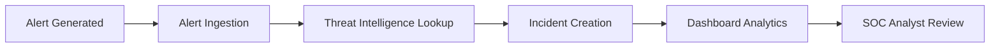
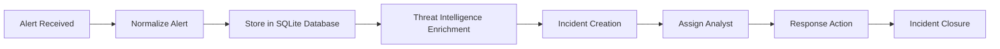
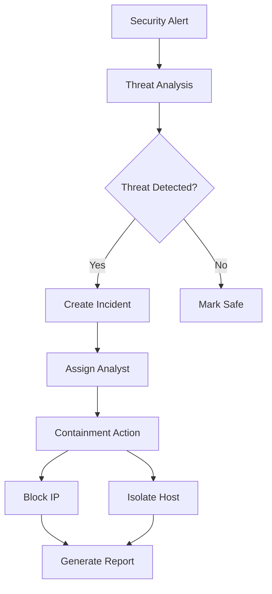
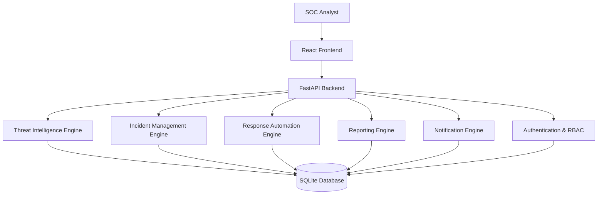
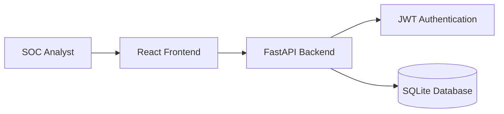

# SOAR Incident Containment Engine


**Infotact Cybersecurity Internship Project**

## Project Overview


The SOAR (Security Orchestration, Automation, and Response) Incident Containment Engine is designed to automate security incident detection, threat intelligence analysis, alert management, and incident response workflows. The platform helps security teams reduce response time and improve incident handling efficiency through automation.

---

## Table of Contents

- Overview
- Project Highlights
- Achievements
- Project Statistics
- Features
- Security Capabilities
- Dashboard Workflow
- Alert Lifecycle
- Incident Response Workflow
- SOAR Workflow Diagram
- Database Schema
- Architecture
- Technology Stack
- Installation
- API Endpoints
- Project Structure
- Team Members
- Screenshots
- SOC Use Cases
- Security Considerations
- Future Improvements
- Project Status
- Testing
- Deployment
- Documentation
- Project Demo
- License
- Acknowledgements
- Contributors
- Author

# Overview

The SOAR Incident Containment Engine provides a centralized platform for:

- Security Alert Ingestion
- Threat Intelligence Enrichment
- Incident Management
- Analyst Assignment
- Automated Response Actions
- Notification Management
- Audit Logging
- Dashboard Analytics
- Security Reporting
- Role-Based Access Control

The platform helps SOC analysts investigate alerts, enrich incidents with threat intelligence, perform containment actions, and generate operational reports from a single interface.

---
# Project Highlights

✅ 30+ REST APIs

✅ Threat Intelligence Integration

✅ Incident Assignment Workflow

✅ Automated Response Actions

✅ Dashboard Analytics

✅ Security Reporting

✅ Audit Logging

✅ JWT Authentication

✅ Role-Based Access Control (RBAC)

---

# Achievements

- Developed 30+ REST APIs
- Implemented Threat Intelligence Engine
- Designed Incident Management Workflow
- Integrated JWT Authentication & RBAC
- Built Security Analytics Dashboard
- Implemented Audit Logging System
- Created Automated Response Actions

# Project Statistics

| Metric | Value |
|----------|----------|
| APIs Developed | 30+ |
| Core Modules | 8 |
| Database | SQLite |
| Backend Framework | FastAPI |
| Frontend Framework | React |
| Authentication | JWT |
| Authorization | RBAC |
 
# Features

The SOAR Incident Containment Engine combines threat intelligence, incident management, response automation, reporting, and security analytics into a unified platform for SOC teams.

## Alert Management
- Alert Ingestion
- Alert Normalization
- Alert Tracking
- High-Risk Incident Detection

## Threat Intelligence
- IOC Investigation
- IP Reputation Lookup
- Threat Enrichment
- Malicious Indicator Detection

## Incident Management
- Incident Creation
- Incident Assignment
- Incident Escalation
- Incident Status Tracking

## Response Automation
- Block Malicious IPs
- Host Isolation
- Automated Containment Actions
- Response History Tracking

## Dashboard & Analytics
- Security Metrics Dashboard
- Incident Trends Analysis
- Response Metrics
- Recent Cases Monitoring

## Reporting
- Incident Reports
- Severity Reports
- Analyst Performance Reports
- Security Analytics Reports

## Authentication & Access Control
- JWT Authentication
- RBAC
- Admin Dashboard
- Analyst Dashboard

## Audit & Notifications
- Audit Logging
- Incident Notifications
- Escalation Alerts
- Activity Tracking

# Security Capabilities

- Threat Intelligence Enrichment
- IOC Investigation
- Incident Correlation
- Automated Containment
- Incident Escalation
- Analyst Assignment
- Audit Logging
- Dashboard Analytics
- JWT Authentication
- RBAC Authorization
- Response Automation
- Security Reporting

# Dashboard Workflow Explanation



---

# Alert Lifecycle



---

# Incident Response Workflow



---

# SOAR Workflow Diagram



---

# Database Schema

```text
Alert
 ├── id
 ├── source
 ├── severity
 ├── status
 ├── assigned_to

ThreatIntel
 ├── ip_address
 ├── threat_score
 ├── reputation

ResponseAction
 ├── incident_id
 ├── action
 ├── timestamp
```

---
# Architecture

## System Architecture



---

## Core Modules

- Alert Ingestion Engine
- Threat Intelligence Engine
- Incident Management Engine
- Automated Response Engine
- Reporting Engine
- Notification Engine
- Authentication Module

---
## Backend

- FastAPI
- Python
- SQLAlchemy
- Pydantic

## Database

- SQLite

## Security

- JWT Authentication
- Role-Based Access Control

## Frontend

- React.js
- Axios

## Development Tools

- Git
- GitHub
- Swagger UI
- VS Code

---

# Installation

## Clone Repository

```bash
git clone https://github.com/Prasad-Kedar/SOAR-Incident-Containment-Engine.git
cd SOAR-Incident-Containment-Engine
```
## Create Virtual Environment

```bash
python -m venv venv
```

## Activate Virtual Environment

### Windows

```bash
venv\Scripts\activate
```

### Linux / Mac

```bash
source venv/bin/activate
```
## Environment Variables

No environment variables are currently required.

For production deployment, the following may be added:

- JWT_SECRET_KEY
- DATABASE_URL
- API_BASE_URL

# Install Dependencies

```bash
pip install -r requirements.txt
```
## Run Backend

```bash
cd backend
uvicorn main:app --reload

## Run Frontend

```bash
cd frontend
npm install
npm run dev
```
```

Backend URL:

```text
http://127.0.0.1:8001
```

Swagger Documentation:

```text
http://127.0.0.1:8001/docs
```
# API Endpoints

## Alerts

| Method | Endpoint |
|----------|----------|
| POST | /alerts |
| GET | /alerts |

## Dashboard

| Method | Endpoint |
|----------|----------|
| GET | /dashboard/summary |
| GET | /dashboard/recent |
| GET | /dashboard/security-metrics |
| GET | /dashboard/response-metrics |
| GET | /dashboard/trends |
| GET | /dashboard/recent-cases |

## Threat Intelligence

| Method | Endpoint |
|----------|----------|
| GET | /threat/{ip} |
| GET | /ioc/{ip} |
| GET | /threats/malicious |
| GET | /threats/stats |

## Incident Management

| Method | Endpoint |
|----------|----------|
| GET | /incident/{incident_id}/intel |
| GET | /incidents/high-risk |
| PUT | /incident/{incident_id}/assign/{analyst_name} |
| POST | /incident/{incident_id}/escalate |

## Response Actions

| Method | Endpoint |
|----------|----------|
| POST | /response/block-ip/{incident_id} |
| POST | /response/isolate-host/{incident_id} |
| GET | /responses |

## Notifications

| Method | Endpoint |
|----------|----------|
| POST | /notify/{incident_id} |
| GET | /notifications |

## Authentication

| Method | Endpoint |
|----------|----------|
| POST | /users |
| POST | /login |
| GET | /secure/dashboard |
| GET | /admin/dashboard |
| GET | /analyst/dashboard |
| GET | /role/{role} |

## Reporting

| Method | Endpoint |
|----------|----------|
| GET | /reports/incidents |
| GET | /reports/severity |
| GET | /reports/analysts |

## Audit Logging

| Method | Endpoint |
|----------|----------|
| POST | /audit/log |
| GET | /audit/logs |

---

# Project Structure

```text
SOAR-Incident-Containment-Engine
│
├── backend
│   ├── main.py
│   ├── models.py
│   ├── models_db.py
│   ├── database.py
│   ├── db_session.py
│   ├── normalizer.py
│   ├── threat_intel.py
│   ├── alerts.py
│   └── sample_alert.json
│
├── Frontend
│
├── docs
│   ├── Threat_Intelligence_Documentation.md
│   ├── dashboard_analytics.md
│   ├── response_workflow.md
│   ├── notification_workflow.md
│   ├── audit_workflow.md
│   └── Projectplan.md
│
├── Screenshots
│
└── README.md
```

# Team Members

| Name | Role | Responsibilities |
|------|------|------------------|
| Prasad Kedar | Team Lead | Backend Development, Architecture, Threat Intelligence, Reporting APIs, Documentation, Deployment Planning |
| Almeen | Frontend Developer | React Integration, Dashboard UI, API Integration |
| Adarsh | QA & Testing | API Testing, Validation, Security Testing |
| Nelna | Documentation | User Guides, Screenshots, Documentation Support |


# Screenshots

### Swagger UI


### Dashboard


### Alerts API


### Cases API


### Reports API


### Threat Feed


### Render Deployment

---

# SOC Use Cases

## Malicious IP Detection

1. Alert Generated
2. Threat Lookup Performed
3. Incident Created
4. Analyst Assigned
5. Malicious IP Blocked
6. Incident Closed

## Host Compromise Investigation

1. Alert Received
2. Threat Intelligence Enrichment
3. Incident Escalation
4. Host Isolation
5. Response Logged
6. Report Generated

# Security Considerations

- JWT Authentication
- Password Hashing
- Role-Based Access Control (RBAC)
- Audit Logging
- Input Validation
- Secure API Access
- Threat Intelligence Validation

# Future Improvements

- Real-time alert streaming
- SIEM integration
- VirusTotal API integration
- AbuseIPDB integration
- Email and Slack notifications
- Multi-user authentication
- Advanced analytics dashboard
- Automated playbooks
- Docker deployment
- Kubernetes deployment
- CI/CD pipeline integration
- Cloud deployment support
- AI-powered threat correlation

## Project Status

🟢 Backend: Live on Render

🟡 Frontend: Integration in Progress

🟢 Documentation: Complete

🟢 API Testing: Complete


## UI Design

The dashboard UI includes:

* Header Navigation
* Sidebar Navigation
* Active Alerts Section
* Incident Statistics
* Recent Activities

### UI Files

* `ui/wireframes/dashboard-wireframe.md`
* `ui/ui-requirements.md`

---

## Testing

### Testing Activities

* Functional Testing
* API Testing
* Integration Testing
* User Acceptance Testing

### Testing Tools

* Postman
* Pytest

---
# Deployment

| Component | Platform | Status |
|-----------|----------|--------|
| Backend | Render | ✅ Live |
| Frontend | Vercel | ✅ Live |
| API Docs | Swagger | ✅ Live |

## Live Demo

### Backend API
https://soar-incident-containment-engine.onrender.com

### Swagger Documentation
https://soar-incident-containment-engine.onrender.com/docs

### Frontend
_To be deployed on Vercel_

## Planned Deployment
- Docker Containerization
- Cloud Deployment
- Kubernetes Support
- CI/CD Pipeline Integration
## Documentation

The project documentation includes:

* Software Requirements Specification (SRS)
* Test Cases
* Test Reports
* API Documentation
* User Guide
* Bug Reports

---
## Project Demo

🎥 Demo Video:

[Watch Demo Video](https://youtu.be/VqMqUd9eYB8?si=RdB9dlTFJiotBA5b)


---

# Contributors

- Prasad Kedar
- Alameen
- Nelna
- Adarsh
    
## SOAR Workflow Diagram

```text
+-----------------+
| Alert Generated |
+-----------------+
         |
         v
+-----------------+
| Alert Ingestion |
+-----------------+
         |
         v
+------------------------------+
| Threat Intelligence Enrichment |
+------------------------------+
         |
         v
+------------------+
| Incident Creation|
+------------------+
         |
         v
+-------------------+
| Automated Analysis|
+-------------------+
         |
         v
+-------------------+
| Containment Action|
+-------------------+
         |
         v
+---------------+
| Investigation |
+---------------+
         |
         v
+------------+
| Resolution |
+------------+
         |
         v
+---------+
| Closure |
+---------+
```

 Description

The SOAR platform automates incident handling from alert ingestion to final closure.

## Incident Response Workflow

```text
+-----------+
| Detection |
+-----------+
      |
      v
+----------+
| Analysis |
+----------+
      |
      v
+-------------+
| Containment |
+-------------+
      |
      v
+-------------+
| Eradication |
+-------------+
      |
      v
+----------+
| Recovery |
+----------+
      |
      v
+-----------------+
| Lessons Learned |
+-----------------+
```

 Description

1. Detection of security events.
2. Analysis and validation.
3. Containment of affected assets.
4. Removal of threats.
5. Recovery of systems.
6. Documentation and improvement.

## Document Alert Lifecycle

```text
Alert Generated
      |
      v
Alert Collected
      |
      v
Alert Validated
      |
      v
Alert Prioritized
      |
      v
Incident Created
      |
      v
Investigation
      |
      v
Response Executed
      |
      v
Incident Closed
```

 Description

The alert lifecycle tracks a security alert from creation through investigation, response, and closure.

## Dashboard Workflow Explanation

```text
+----------------+
| Dashboard Load |
+----------------+
        |
        v
+-------------+
| API Request |
+-------------+
        |
        v
+--------------------+
| Service Processing |
+--------------------+
        |
        v
+----------------+
| Database Query |
+----------------+
        |
        v
+------------------+
| Data Aggregation |
+------------------+
        |
        v
+------------------+
| Dashboard Display|
+------------------+
        |
        v
+--------------+
| User Actions |
+--------------+
```

Description
- Dashboard requests data through APIs.
- Services process alerts and incidents.
- Data is retrieved from the database.
- Results are displayed as widgets, tables, and charts.
- Users can investigate alerts and trigger containment actions.

## License

This project was developed for educational purposes as part of the Infotact Cybersecurity Internship Program.

---

## Acknowledgements

Developed during the Infotact Cybersecurity Internship under the guidance of mentors and project reviewers.

---
# Contributors

- Prasad Kedar (Team Lead)
- Almeen
- Adarsh
- Nelna

## Author
## Prasad Kedar (Team Lead)

Responsible for:

- Backend Architecture Design
- Threat Intelligence Development
- Incident Management APIs
- Reporting Engine
- Authentication & RBAC
- Project Documentation
- Deployment Planning
- Team Coordination

---

⭐ If you found this project useful, consider giving it a star.

Developed during the Infotact Cybersecurity Internship.

Made with ❤️ using FastAPI, React and Python.