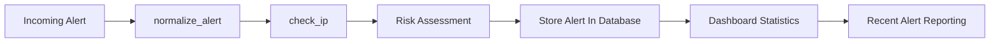

# SOAR Incident Containment Engine - Module Documentation

## Overview

The SOAR Incident Containment Engine automates security alert processing, threat intelligence analysis, incident tracking, and reporting through a FastAPI-based backend.

---

# Backend Module Documentation

## main.py

Main entry point of the FastAPI application.

### Responsibilities

* Starts the FastAPI server
* Registers API endpoints
* Receives security alerts
* Performs alert normalization
* Executes threat intelligence checks
* Stores alerts in the database
* Provides dashboard statistics

---

## alerts.py

Temporary alert storage module.

### Responsibilities

* Maintains alert records during development
* Supports alert management operations

---

## database.py

Database configuration module.

### Responsibilities

* Configures database connection
* Initializes database services
* Provides database access functionality

---

## db_session.py

Database session management module.

### Responsibilities

* Creates database sessions
* Manages database connections
* Handles session lifecycle

---

## models.py

Application data model definitions.

### Responsibilities

* Defines request schemas
* Validates incoming alert data
* Structures API payloads

---

## models_db.py

Database table model definitions.

### Responsibilities

* Defines database entities
* Maps Python objects to database tables
* Stores alert information

---

## normalizer.py

Alert normalization module.

### Responsibilities

* Standardizes incoming alert data
* Ensures consistent field formats
* Prepares alerts for processing

---

## threat_intel.py

Threat intelligence module.

### Responsibilities

* Checks source IP reputation
* Calculates risk scores
* Identifies malicious indicators
* Provides threat assessment results

---

# API Endpoint Documentation

## GET /

Returns API status information.

### Response

```json
{
  "message": "SOAR Incident Containment Engine API Running"
}
```

---

## POST /alerts

Receives a security alert, normalizes the data, performs threat intelligence checks, and stores the alert.

### Response

```json
{
  "status": "success",
  "message": "Alert stored successfully",
  "risk_score": 85,
  "threat": true
}
```

---

## GET /alerts

Returns all stored alerts.

### Response

```json
[
  {
    "id": 1,
    "src_ip": "192.168.1.10",
    "severity": "high",
    "event_type": "failed_login",
    "timestamp": "2025-06-18T10:30:00",
    "status": "OPEN"
  }
]
```

---

## GET /dashboard/summary

Returns dashboard statistics.

### Response

```json
{
  "total_alerts": 10,
  "high_alerts": 4,
  "medium_alerts": 3,
  "low_alerts": 3
}
```

---

## GET /dashboard/recent

Returns the five most recent alerts.

### Response

```json
[
  {
    "id": 10,
    "src_ip": "192.168.1.50",
    "severity": "high",
    "event_type": "malware",
    "timestamp": "2025-06-18T12:00:00",
    "status": "OPEN"
  }
]
```

---

# Alert Processing Workflow



---

# Setup Instructions

## Clone Repository

```bash
git clone https://github.com/Prasad-Kedar/SOAR-Incident-Containment-Engine.git
cd SOAR-Incident-Containment-Engine
```

## Install Dependencies

```bash
pip install -r requirements.txt
```

## Run Application

```bash
uvicorn main:app --reload
```

## API Documentation

Open:

```text
http://127.0.0.1:8000/docs
```

for Swagger UI documentation.

---

# Usage

1. Start the FastAPI server.
2. Send alerts using the POST `/alerts` endpoint.
3. View stored alerts using GET `/alerts`.
4. Monitor statistics using GET `/dashboard/summary`.
5. Review recent alerts using GET `/dashboard/recent`.

```
```
