# SOAR Incident Containment Engine – API Testing Report

## Objective

Setup SQLite database, store alerts, test API endpoints, create test cases, and verify application stability.

---

## 1. Swagger API Overview

**Purpose:** Display all available API endpoints and testing interface.

**Expected Result:**
All endpoints are listed and accessible through Swagger UI.

**Status:** ✅ PASS

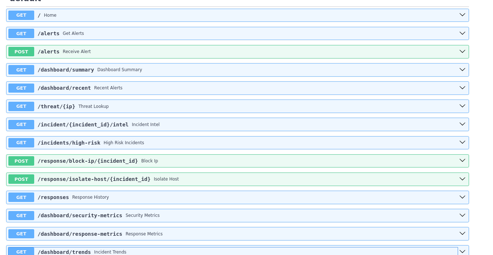

---

## 2. Home Endpoint

**Endpoint:** GET /

**Purpose:** Verify API server status.

**Expected Result:**

```json
{
  "message": "SOAR Incident Containment Engine API Running"
}
```

**Actual Result:**
API returned the expected success message.

**Status:** ✅ PASS

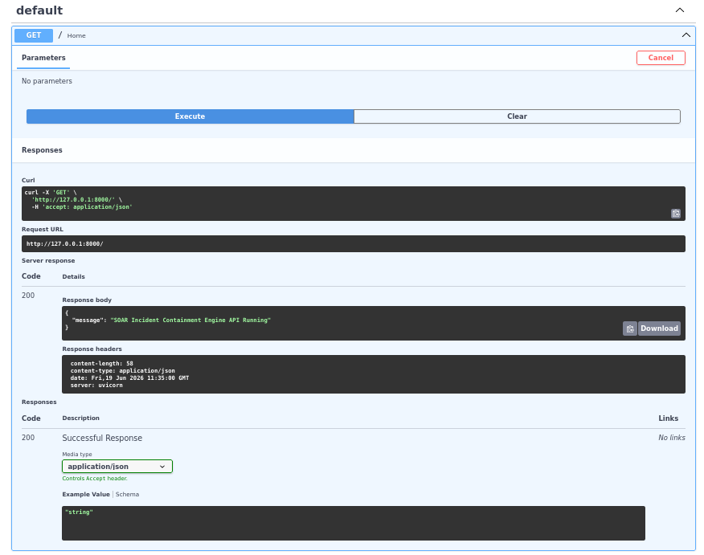

---

## 3. Alert Creation Success

**Endpoint:** POST /alerts

**Purpose:** Verify successful ingestion and storage of a security alert.

**Test Data:**

```json
{
  "src_ip": "192.168.1.100",
  "severity": "high",
  "event_type": "Brute Force",
  "timestamp": "2026-06-19T10:00:00"
}
```

**Expected Result:**
Alert stored successfully.

**Actual Result:**

```json
{
  "status": "success",
  "message": "Alert stored successfully",
  "risk_score": 10,
  "threat": false
}
```

**Status:** ✅ PASS

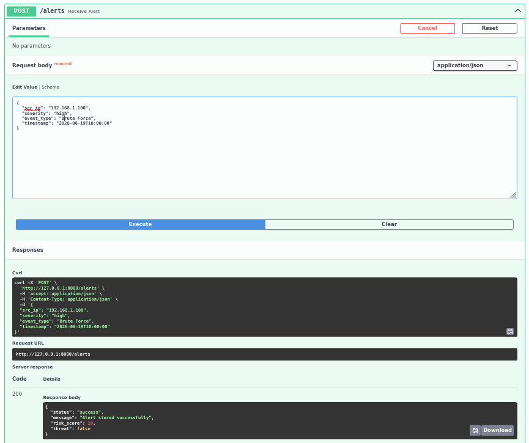

---

## 4. Alert Creation Validation Error

**Endpoint:** POST /alerts

**Purpose:** Verify API validation for invalid requests.

**Expected Result:**
Validation error should be returned for incomplete or incorrect input.

**Actual Result:**
422 Validation Error returned successfully.

**Status:** ✅ PASS

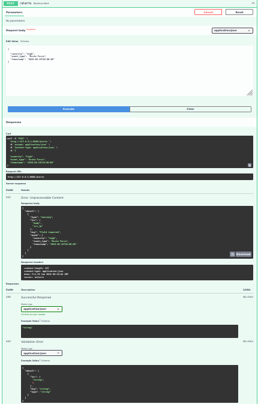

---

## 5. Dashboard Summary

**Endpoint:** GET /dashboard/summary

**Purpose:** Display alert statistics.

**Expected Result:**
Dashboard summary returned.

**Actual Result:**

```json
{
  "total_alerts": 5,
  "high_alerts": 3,
  "medium_alerts": 0,
  "low_alerts": 0
}
```

**Status:** ✅ PASS

.png)

---

## 6. Recent Alerts

**Endpoint:** GET /dashboard/recent

**Purpose:** Retrieve recent stored alerts.

**Expected Result:**
Recent alerts list returned.

**Actual Result:**
Alert records successfully retrieved from SQLite database.

**Status:** ✅ PASS

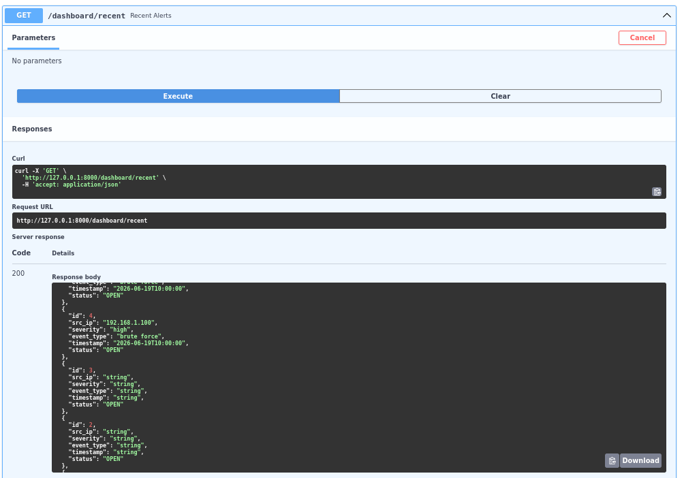

---

## 7. Threat Lookup

**Endpoint:** GET /threat/{ip}

**Test IP:** 1

**Purpose:** Check threat intelligence information.

**Actual Result:**

```json
{
  "ip": "1",
  "risk_score": 10,
  "threat": false
}
```

**Status:** ✅ PASS

### Screenshot – Input

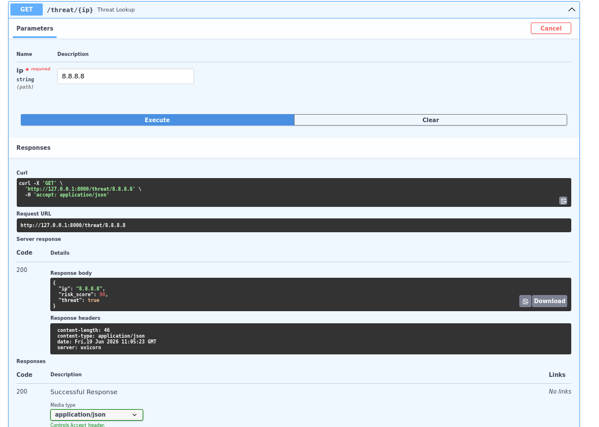

### Screenshot – Result

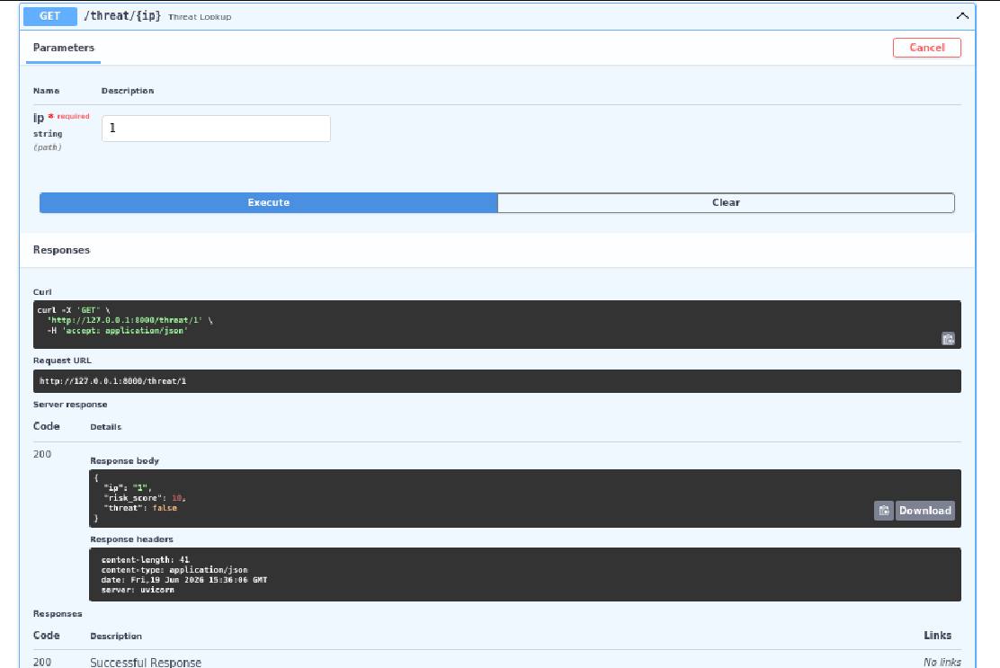

---

## 8. Incident Intelligence

**Endpoint:** GET /incident/{incident_id}/intel

**Test Incident ID:** 1

**Purpose:** Retrieve intelligence details for an incident.

**Actual Result:**

```json
{
  "incident_id": 1,
  "src_ip": "192.168.1.100",
  "risk_score": 10,
  "threat": false
}
```

**Status:** ✅ PASS

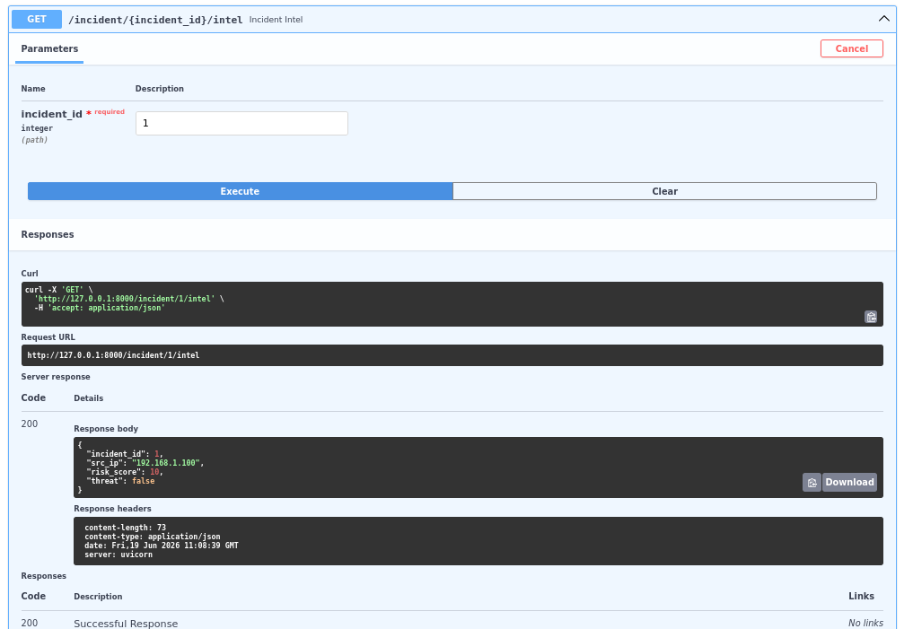

---

## 9. High Risk Incidents

**Endpoint:** GET /incidents/high-risk

**Purpose:** Retrieve all high-severity incidents.

**Expected Result:**
High-risk incidents list returned.

**Actual Result:**
Multiple high-risk incidents retrieved successfully.

**Status:** ✅ PASS

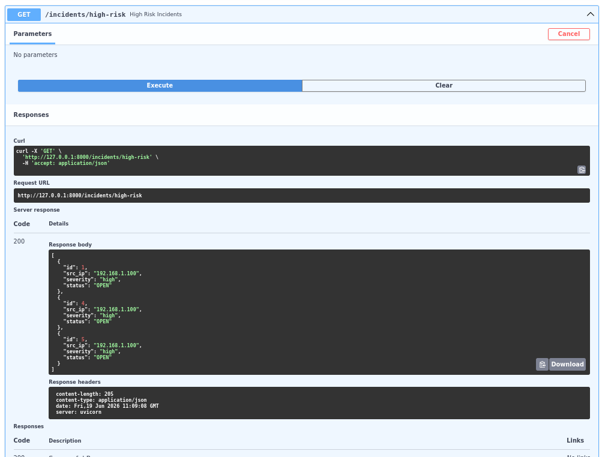

---

## 10. Block IP Response

**Endpoint:** POST /response/block-ip/{incident_id}

**Test Incident ID:** 100

**Purpose:** Simulate IP blocking response action.

**Actual Result:**

```json
{
  "message": "IP blocked successfully"
}
```

**Status:** ✅ PASS

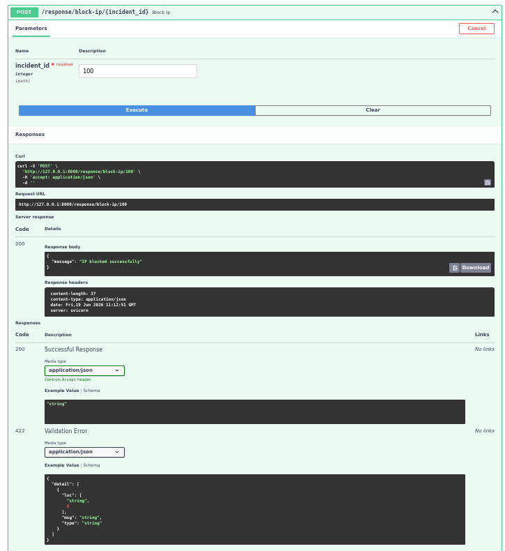

---

## 11. Isolate Host Response

**Endpoint:** POST /response/isolate-host/{incident_id}

**Test Incident ID:** 2

**Purpose:** Simulate host isolation response action.

**Actual Result:**

```json
{
  "message": "Host isolated successfully"
}
```

**Status:** ✅ PASS

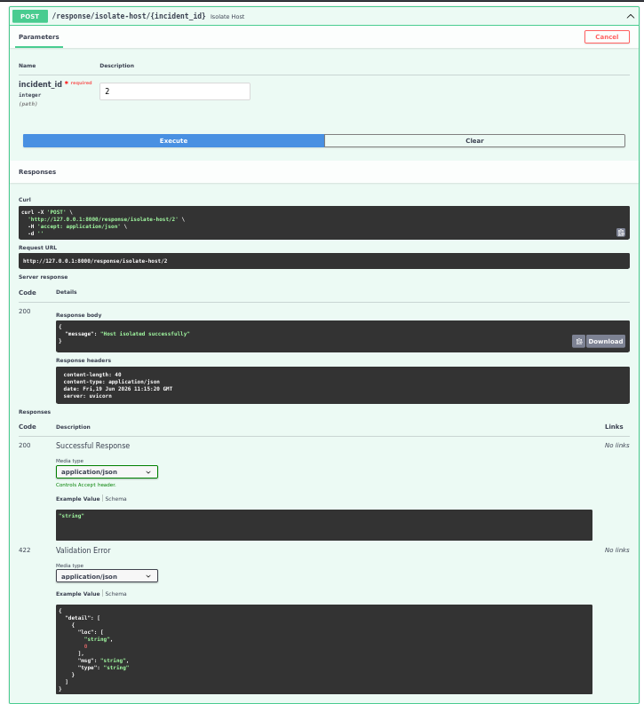

---

## 12. Response History

**Endpoint:** GET /responses

**Purpose:** Retrieve all response actions executed.

**Expected Result:**
Response history records returned.

**Actual Result:**
Block IP and Isolate Host actions successfully displayed.

**Status:** ✅ PASS

**Description:**
Displays response action history including Block IP and Isolate Host operations executed by the system.

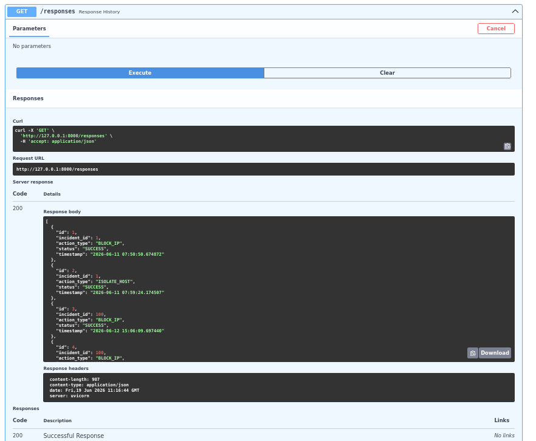

---

## 13. Security Metrics Dashboard

**Endpoint:** GET /dashboard/security-metrics

**Purpose:** Display overall security statistics.

**Actual Result:**

```json
{
  "total_alerts": 5,
  "open_incidents": 5,
  "closed_incidents": 0,
  "high_risk_incidents": 3
}
```

**Status:** ✅ PASS

**Description:**
Shows security-related metrics including total alerts, open incidents, closed incidents, and high-risk incidents.

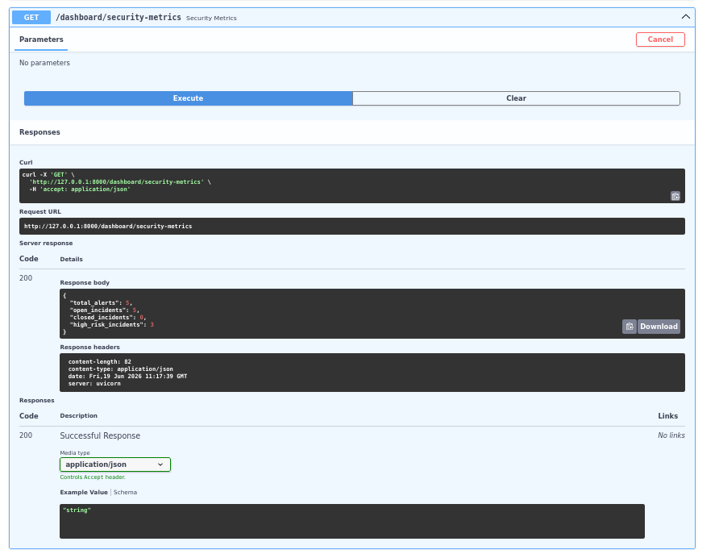

---

## 14. Response Metrics Dashboard

**Endpoint:** GET /dashboard/response-metrics

**Purpose:** Display response action statistics.

**Actual Result:**

```json
{
  "total_actions": 8,
  "blocked_ips": 4,
  "isolated_hosts": 4
}
```

**Status:** ✅ PASS

**Description:**
Displays response operation metrics including total actions performed, blocked IP addresses, and isolated hosts.

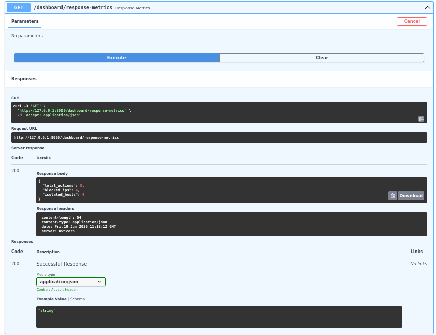

---

## 15. Incident Trends Dashboard

**Endpoint:** GET /dashboard/trends

**Purpose:** Display incident severity trends.

**Actual Result:**

```json
{
  "high": 3,
  "medium": 0,
  "low": 0
}
```

**Status:** ✅ PASS

**Description:**
Displays incident trend statistics categorized by severity levels (High, Medium, Low).

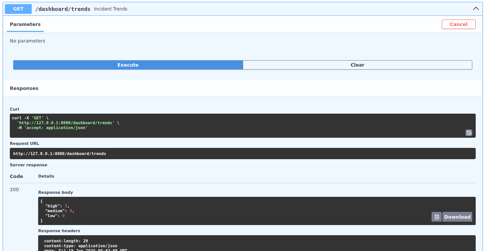

---

# Test Summary

| Endpoint | Status |
|----------|---------|
| GET / | ✅ PASS |
| POST /alerts | ✅ PASS |
| GET /dashboard/summary | ✅ PASS |
| GET /dashboard/recent | ✅ PASS |
| GET /threat/{ip} | ✅ PASS |
| GET /incident/{incident_id}/intel | ✅ PASS |
| GET /incidents/high-risk | ✅ PASS |
| POST /response/block-ip/{incident_id} | ✅ PASS |
| POST /response/isolate-host/{incident_id} | ✅ PASS |
| GET /responses | ✅ PASS |
| GET /dashboard/security-metrics | ✅ PASS |
| GET /dashboard/response-metrics | ✅ PASS |
| GET /dashboard/trends | ✅ PASS |

---

# Conclusion

The SQLite database schema was successfully implemented and tested. Alert records were stored correctly, dashboard analytics endpoints generated accurate results, threat intelligence checks worked as expected, and response actions were recorded successfully. All API endpoints returned valid responses and passed testing.

**Final Status:** ✅ Stable and Tested Application
